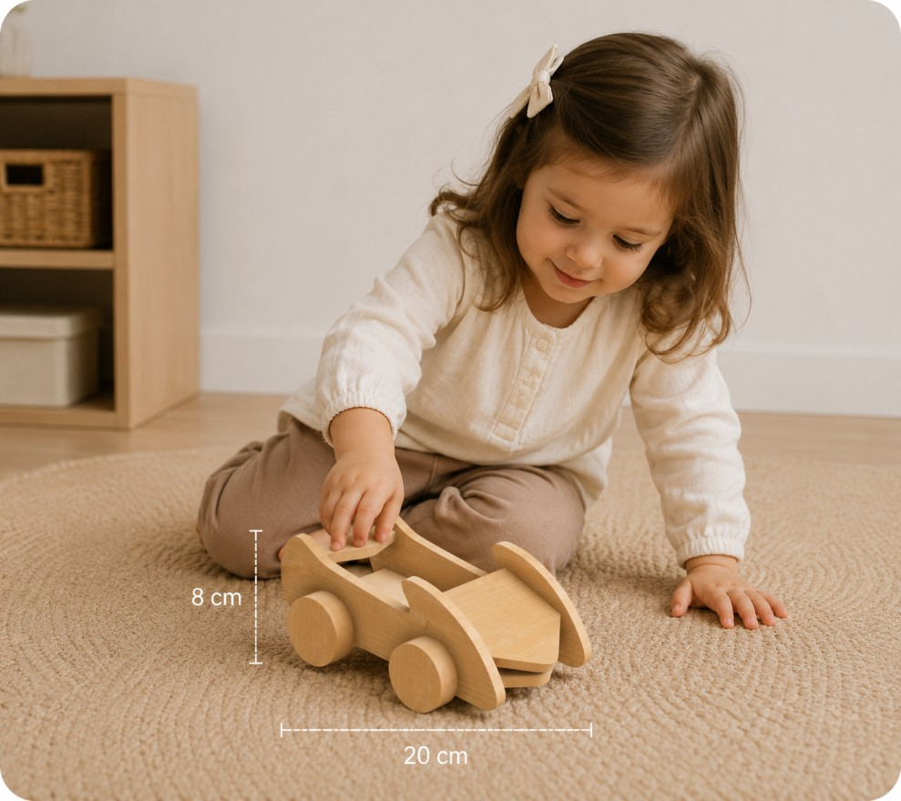
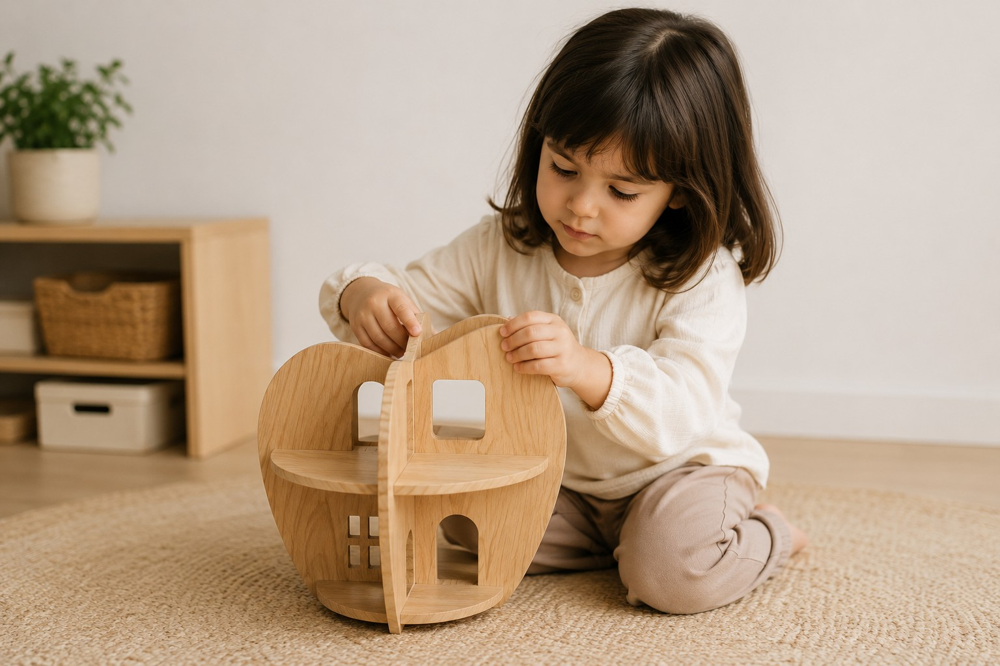
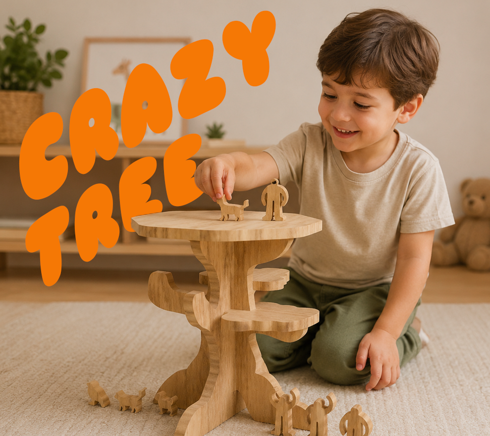

# Crazy Town

> Nós somos o grupo Crazy Town e procuramos através dos nossos brinquedos construir universos que estão para além do que se pode ver ou tocar.

## Elementos do Grupo

| Número  | Nome   |
| ------- | ------ |
| 2024270 | Eva    |
| 2024317 | Leonor |
| 2023225 | Ítalo  |

---

## Contexto de Design

Resumo, referências coletivas e moodboard do grupo encontram-se em [contexto.md](contexto.md).

[Ver contexto completo →](contexto.md)

---

## Galeria de Produtos

<!-- Cada thumbnail liga à página individual de cada produto.
     Cada produto vive em produtos/<numero>-<nome>/index.md
     e tem uma sub-página produtos/<numero>-<nome>/processo.md -->

<!-- markdownlint-disable MD033 -->

  <!-- duplicar o bloco abaixo para cada produto do grupo -->

  <a class="gallery-card" href="produtos/Eva/">
    
    <h3>Crazy Car</h3>
    
Eva

  </a>
  <a class="gallery-card" href="produtos/Leonor/">
    
    <h3>Crazy House</h3>
    
Leonor

  </a>  
  <a class="gallery-card" href="produtos/Ítalo/">
    
    <h3>Crazy Tree</h3>
    
Ítalo

  </a> 
  <!-- duplicar o bloco acima para cada produto do grupo  e substituir _modelo em ambas por <numero>-<nome> -->

<!-- markdownlint-enable MD033 -->
