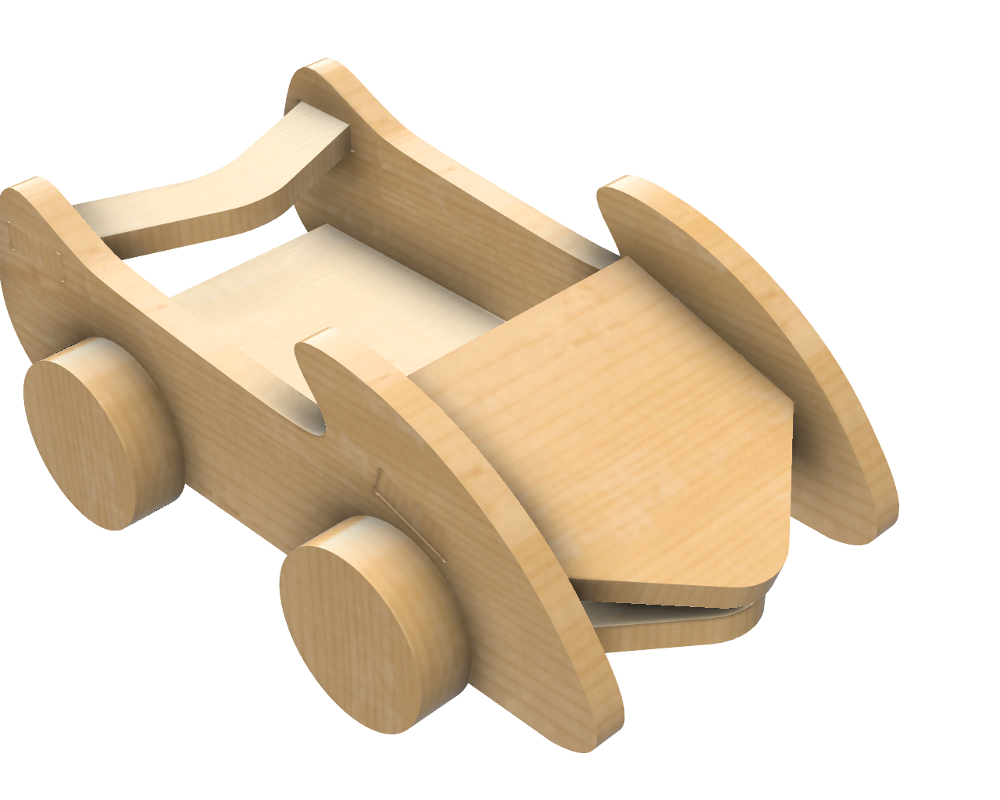
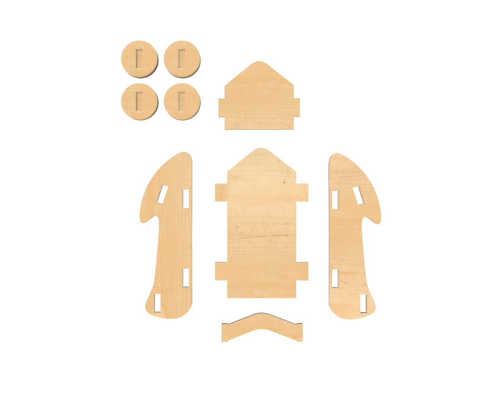

# Crazy Car 

<!--
  HERO: idealmente uma pseudo-sessão fotográfica do produto
  (ver tutorial Pletor.ai nos Recursos da disciplina, em
  /Recursos/AI_exps/). Usa attachments/hero.jpg para o frontmatter.
-->

> Um carrinho que as próprias crianças conseguem montar e desmontar o quanto quiserem para brincar.

## Conceito

Este brinquedo foi pensado de forma a promover o desenvolvimento motor e cognitivo. Um carrinho feito para ser montado e desmontado as vees que as crianças quiserem com encaixes simples e formas suaves e, também, peças grandes tornando este brinquedo numa ótima escolha para crianças entre os 7-10 anos. 
Este brinquedo pode ser usado de forma individual ou em conjunto com outros brinquedos (ex: crazy tree, crazy house, bonecos, etc.).

## Enquadramento

Tendo em conta os brinquedos usados como inspiração para este projeto e o conceito geral, este carrinho foi desenhado de forma a ter uma montagem simples e fácil com formas suaves, orgânicas e peças grandes, sendo um brinquedo adequado e seguro para crianças mais pequenas. Este brinquedo foi pensado e criado de forma a fazer parte de um universo com outros brinquedos mas também sendo possivel brincar de forma individual.

## Tecnologia

Briquedo feito com madeira de pinho para ser cortado em CNC.

- Modelo 3D: [<!-- embed Fusion ou link a360.co -->](https://a360.co/4o7ojvM)
- Ficheiros: `attachments/`

## Função

Um carrinho puzzle de montagem simples e fácil para crianças entre os 7-10 anos montarem e brincarem. Este brinquedo é uma ótima opção para crianças pequenas por conta do tamanho das peças não muito pequenas e pelas suas formas arredondadas tornando a brincadeira segura.

## Apresentação

---

## Processo

O percurso completo de iterações, modelos e pesquisa está em [processo.md](dpiv-galeria-crazytown/produtos/Eva/processo.md), organizado do **mais recente** para o **mais antigo**.

[Ver processo completo →](dpiv-galeria-crazytown/produtos/Eva/processo.md)
