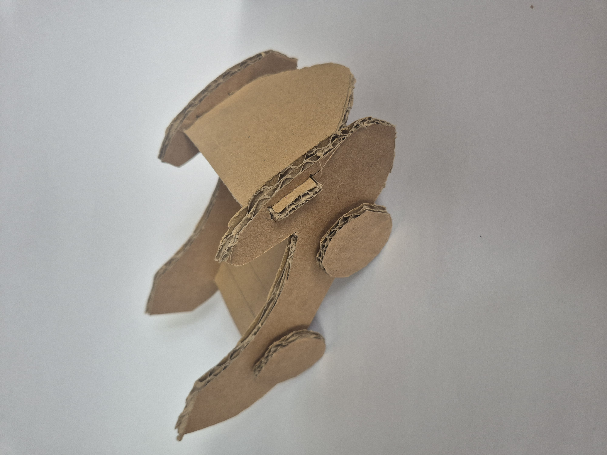
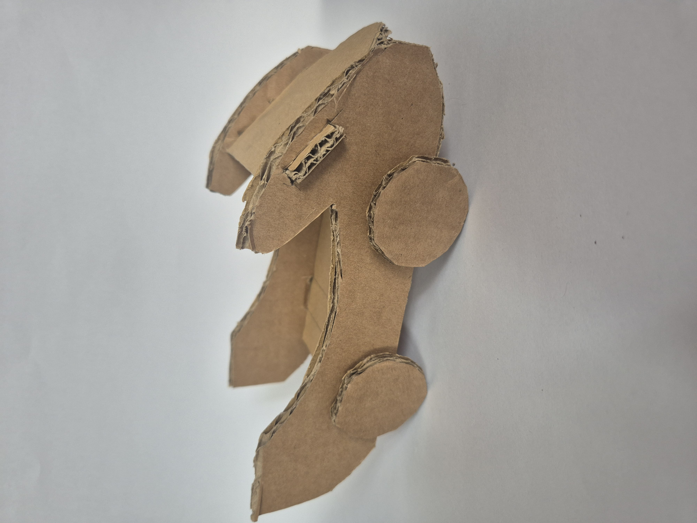
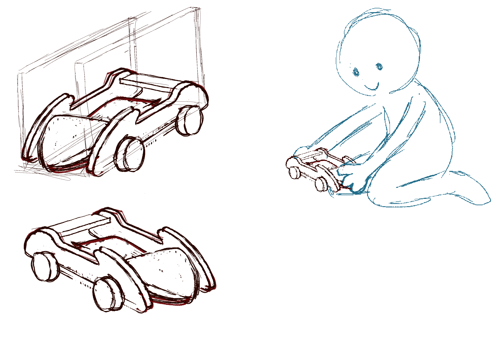
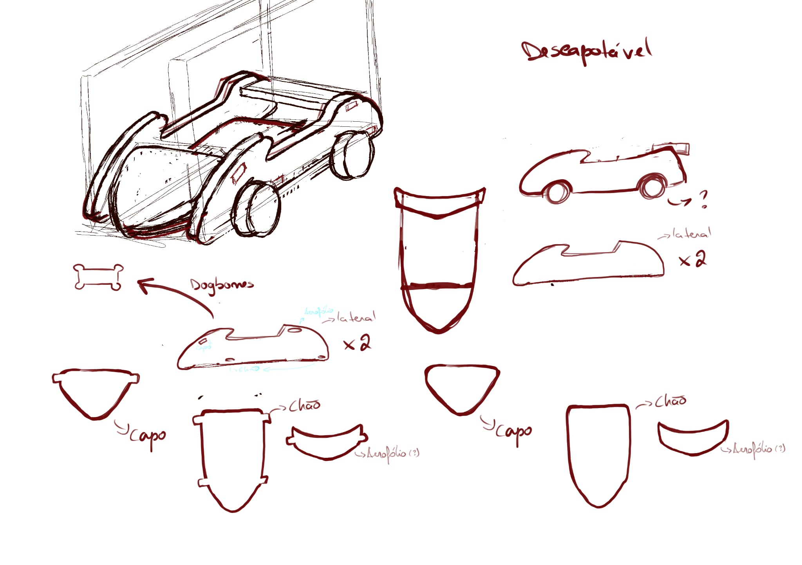
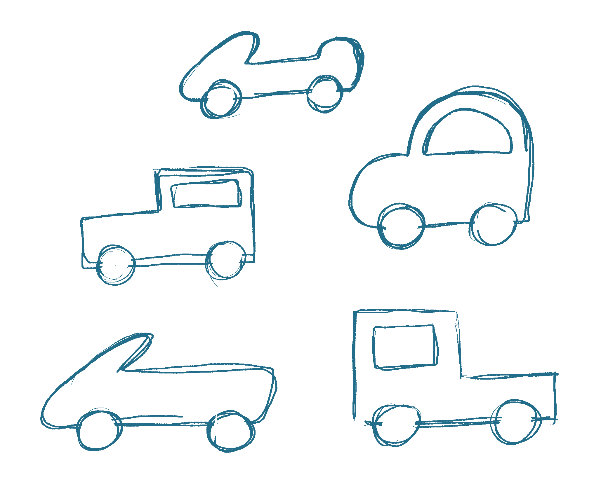
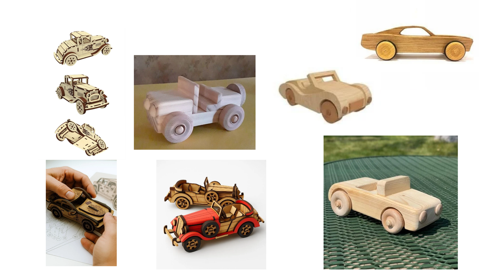
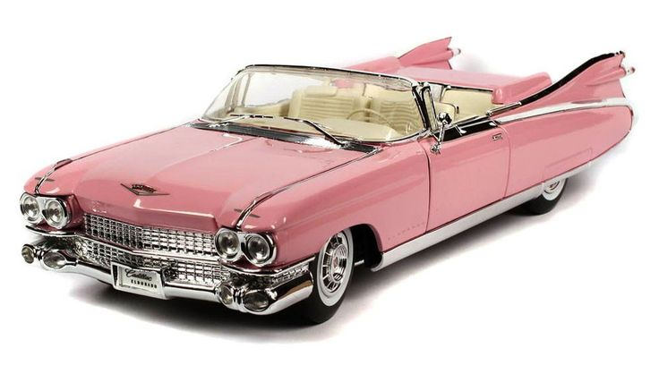
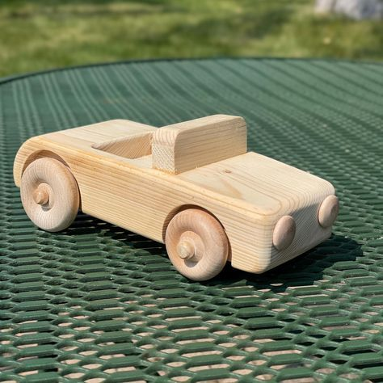

# Processo

## 1. Protótipo(s)

Fotografias em estúdio com fundo branco do(s) protótipo(s) final(is).

## 2. Processo de Prototipagem

Maquinação CNC, montagem, acabamentos pontuais. 

## 3. Protótipos Exploratórios

Testes CNC prévios, ensaios em escala, experiências de juntas/encaixes.

## 4. Modelos 3D

Embed do Fusion (visualização do modelo paramétrico).

https://a360.co/4nqYoPa

## 5. Outros Modelos

Fiz esta maquete exploratória em cartão para testar os encaixes que queria usar e também para explorar a escala do brinquedo e a sua forma.

## 6. Esboços e Pranchas-Resumo

Depois de explorar as formas que iria usar e optar pelo descapotável comecei a desenhar como o carro seria em 3D. Em seguida pensei como as peças se encaixariam, onde e como seriam os encaixes e na escala do brinquedo na mão de uma criança.

## 7. Pesquisa

### 7.1. Aspectos valorizados do moodboard, desconstrução da forma (o que distingue o programa formal)

Tendo em conta que queria fazer um carro descapotável o meu moodboard transmite isso, mas mesmo assim decidi explorar mais algumas formas que este carro poderia ter e acabei por seguir mesmo a alternativa inicial. 

### 7.2. Objetos de referencia

Logo desde o incio deste trabalho quis que o meu carro fosse um descapotável pela sua forma mais organica e fluída, tendo isto em conta fui pesquisar alguns carros desse genero e também alguns brinquedos.

## 9. Outros Elementos

