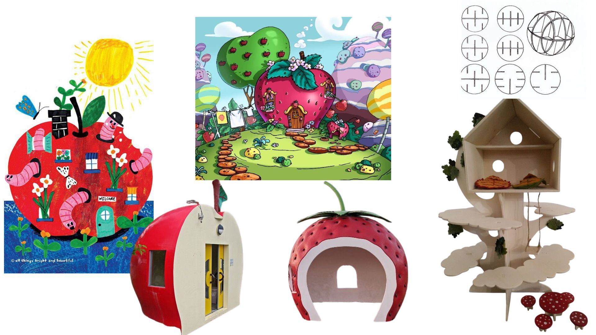
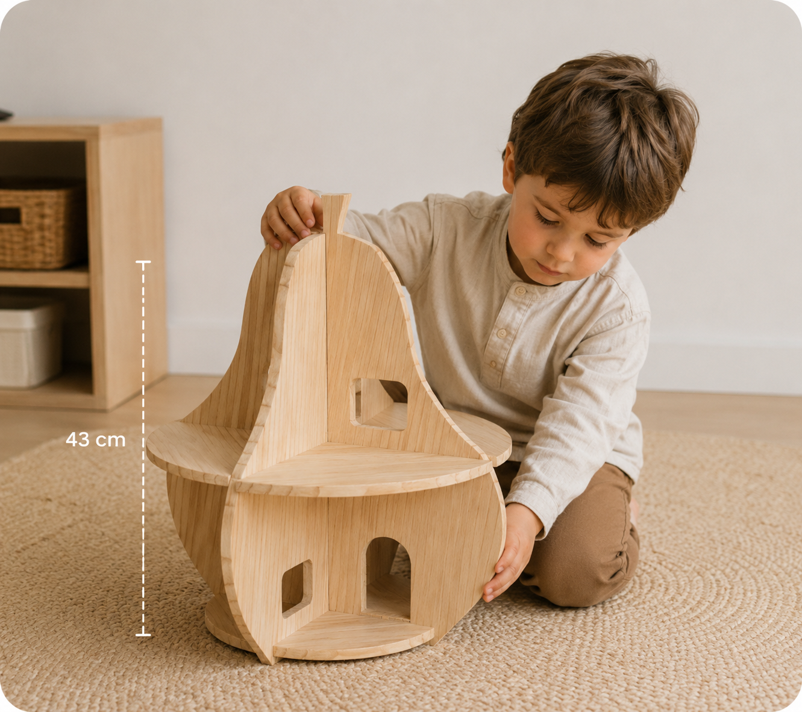
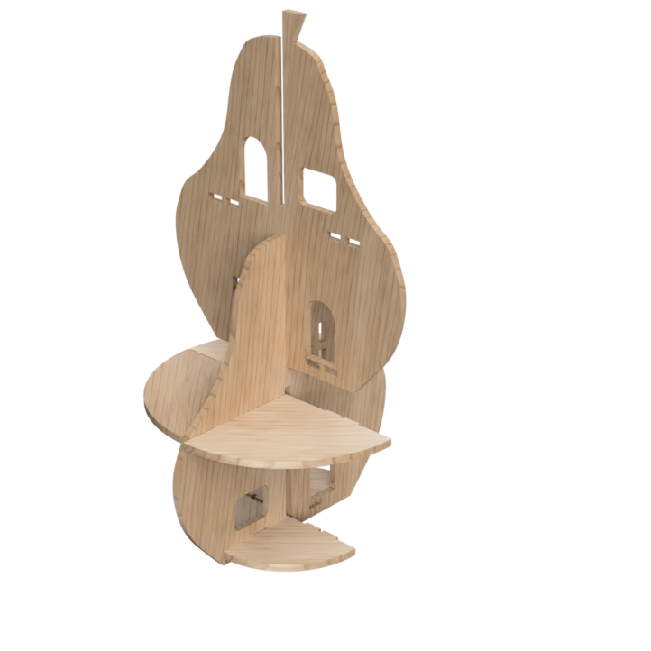
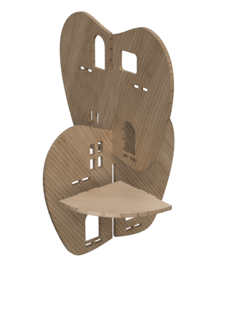
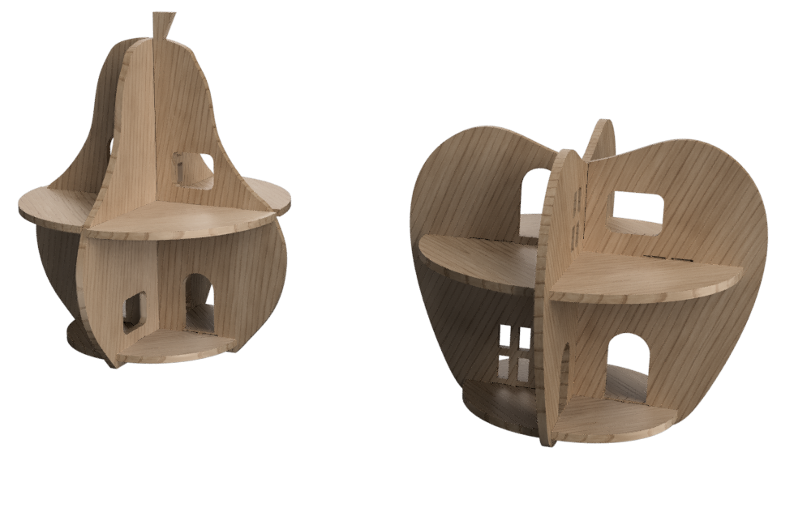
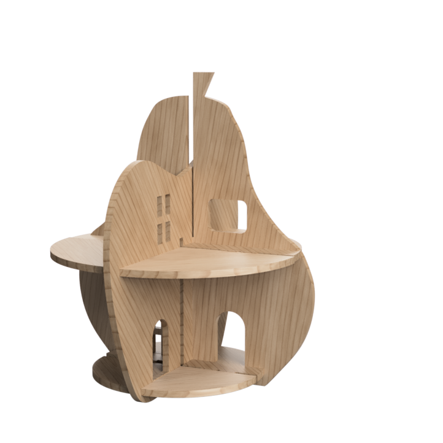

# Crazy House

<!--
  HERO: idealmente uma pseudo-sessão fotográfica do produto
  (ver tutorial Pletor.ai nos Recursos da disciplina, em
  /Recursos/AI_exps/). Usa attachments/hero.jpg para o frontmatter.
-->
> Casa de bonecas, pensada para ser fácil de montar, com linhas orgânicas no formato de frutas.

A página deve tornar **visualmente percetível** a estratégia de resposta ao enunciado.
Segue a estrutura de **prancha-resumo** + **esquema-base** (C-E-T-F).

## Conceito

Quis criar uma casa em formato de fruta, pois lembrei-me da paixão de muitas crianças com a série da Moranguinho e como uma casa em formato de fruta parece tão mais apelativa do que qualquer outra casa. Após explorar várias frutas escolhi duas principais, com a possibilidade de futuramente fazer ainda mais frutas, assim cria-se a oportunidade de juntar várias frutas alimentando a imaginação das crianças. Para além disso, devido ao tamanho e o tema, cria a possibelidade de se juntar aos restantes brinquedos e criar uma "Crazy town".

## Enquadramento

Posicionamento em relação ao contexto de grupo (ver [contexto](../../contexto.md)) e à recolha de objetos a redesenhar.
Para manter o meu brinquedo dentro do contexto de grupo, optei como anteriormente mencionado, criar algo que encaixasse dentro desta cidade. Por isso mesmo, criei uma casa, inicialmente fui para algo mais simples mas depois de decidirmos que queriamos algo mais voltado para a natureza com formas um bocado mais exageradas comecei a procurar referencias que se encaixasse nesse estilo. Foi depois dessa pesquisa e de encontrar referências como as casinhas do mundo da Moranguinho que comecei a idealizar e desenhar como poderia trazer uma versão menos ornamental e distrativa das casinhas.

## Tecnologia

Utilizamos como base para estes brinquedos madeira de Pinho, este brinquedo foi criado para poder ser cortado tanto na CNC como a Laser,criado no fussion.

- Modelo 3D: https://a360.co/3SdzOWs
- Ficheiros: `attachments/`

## Função

Casa de bonecas, para crianças entre 7-10 anos, pensada para estimular a criatividade por ser mais fantasioso e algo que estimula o pensamento e imaginação. Não contém peças pequenas e maioritariamente cantos arredondados, e é feita para poder ser montada e desmontada de várias formas com a possibilidade de juntar peças de outras casas.

## Apresentação

Imagens-chave que sintetizam o produto final.

## Processo

O percurso completo de iterações, modelos e pesquisa está em [processo.md](dpiv-galeria-crazytown/produtos/Leonor/processo.md), organizado do **mais recente** para o **mais antigo**.

[Ver processo completo →](dpiv-galeria-crazytown/produtos/Leonor/processo.md)
