# Processo

> Organizado do **mais recente** para o **mais antigo**. Faz uma seleção que torne clara, aprazível e detalhada a evolução do produto e das ideias.

## 1. Protótipo(s)

Fotografias em estúdio com fundo branco do(s) protótipo(s) final(is).

## 2. Processo de Prototipagem

Maquinação CNC, montagem, acabamentos pontuais. 

## 3. Protótipos Exploratórios

Testes CNC prévios, ensaios em escala, experiências de juntas/encaixes.

## 4. Modelos 3D

https://a360.co/3SdzOWs

## 5. Outros Modelos

Modelos físicos exploratórios, em cartão, espuma, madeira de teste.
Pequeno teste feito em Kapa-Line para explorar os encaixes e as suas dimensões.

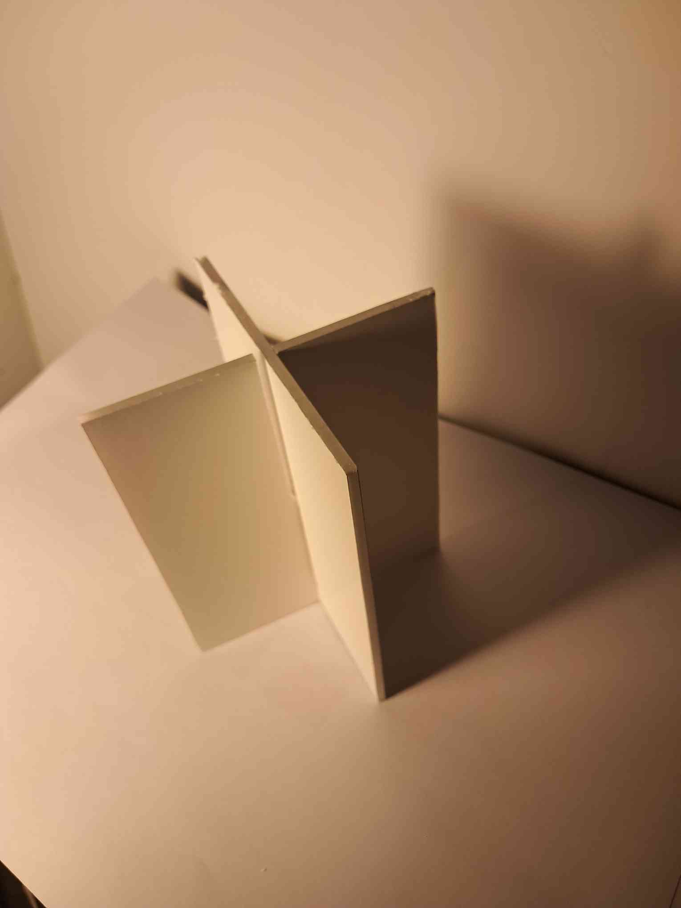
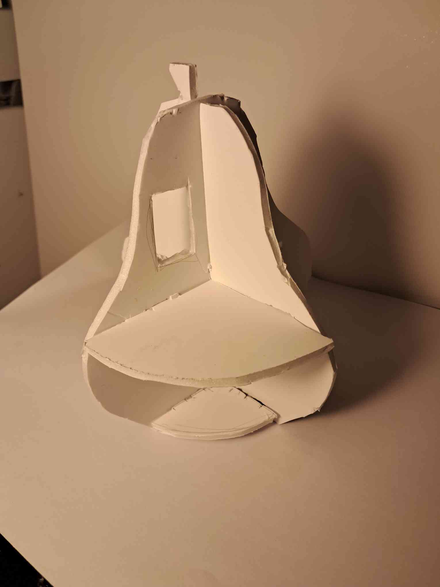
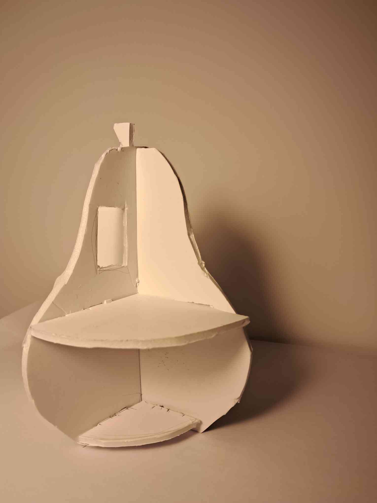

## 6. Esboços e Pranchas-Resumo

Nestes esboços e Pranchas-Resumo comecei a esboçar e idealizar as casas, formatos e dimensões, para além disso comecei a tentar perceber como é que poderia ter os encaixes de modo a que o módulo da pera conseguisse encaixar na maça. Para além disso, comecei também a pensar como iria adicionar o chão/piso às paredes da casa. Debati também esta ideia em aula com o professor para obter ajuda nos encaixes. Por fim, escolhi duas  frutas que fossem as mais fáceis de serem reconhecidas por crianças e comecei a explorar as suas dimensões.

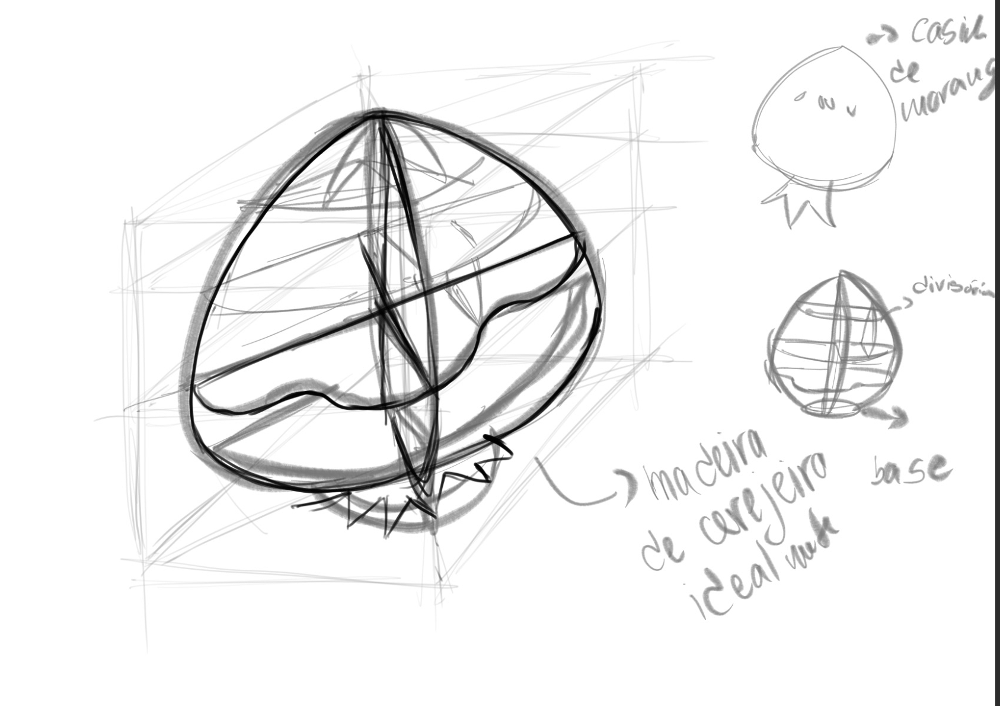
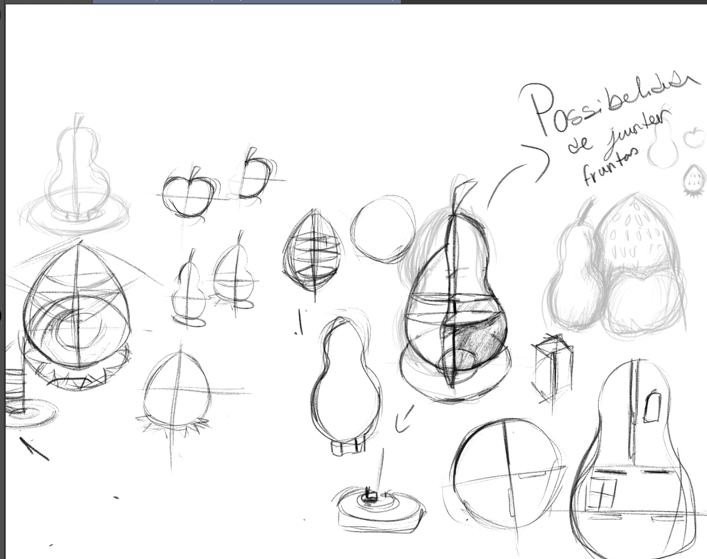
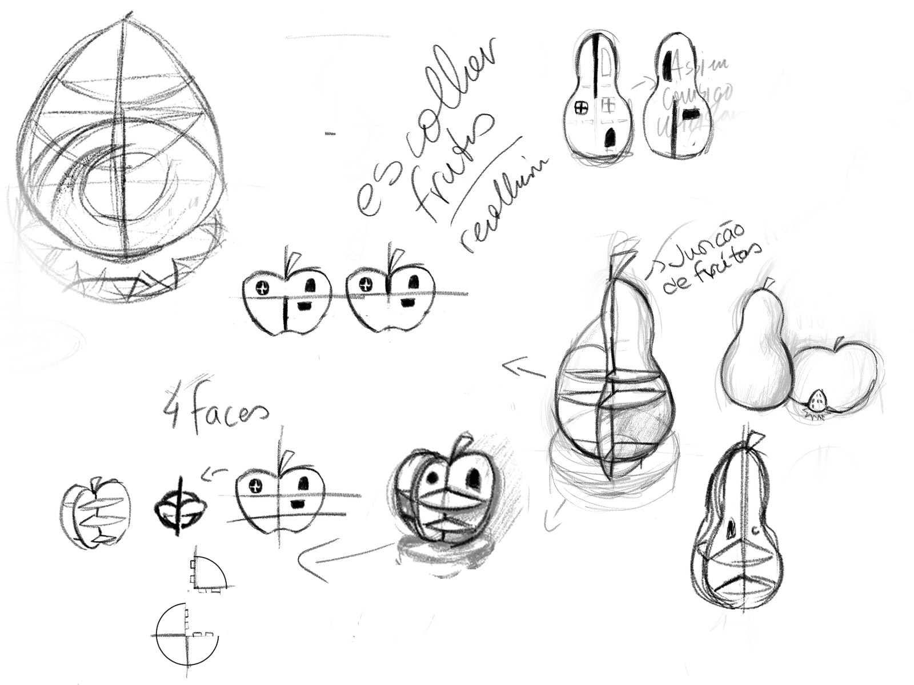

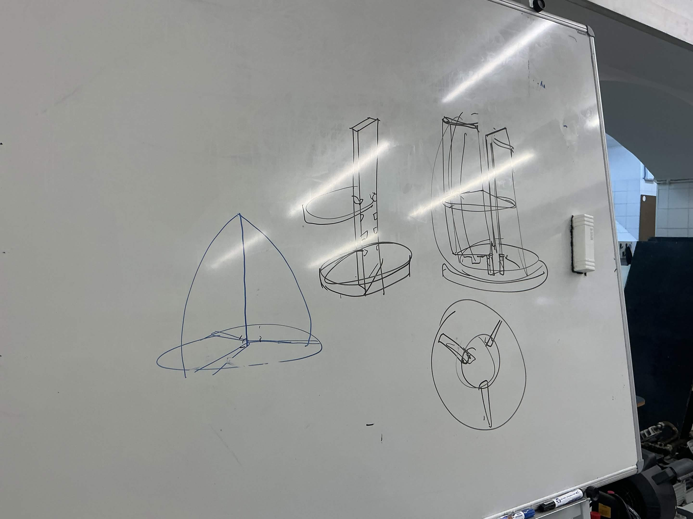
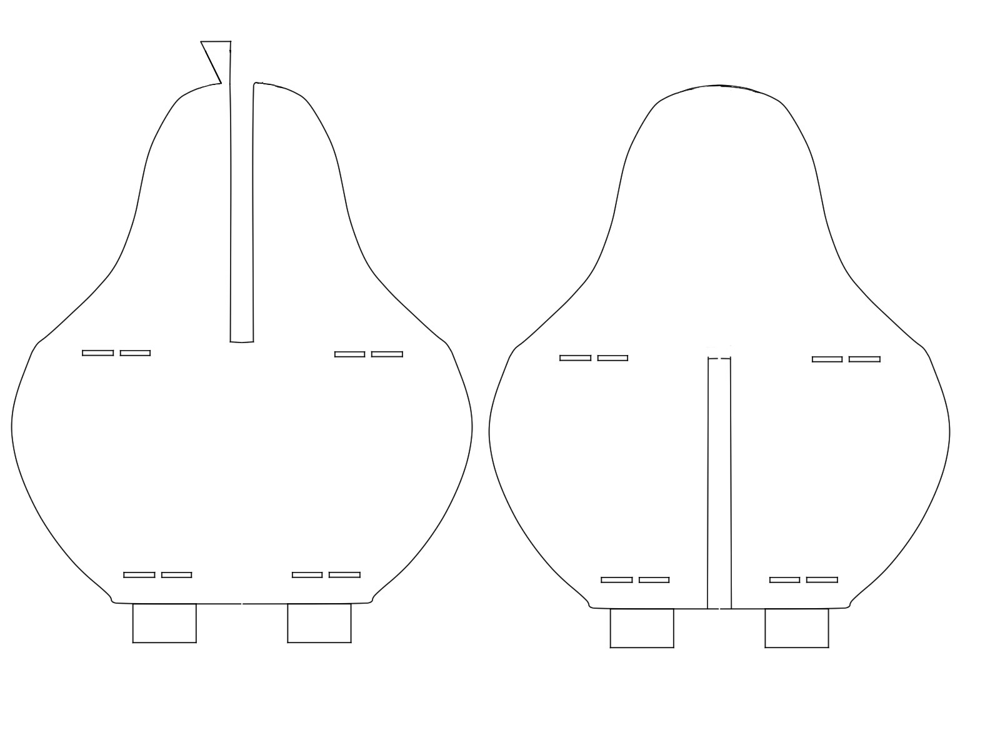
## 7. Pesquisa

### 7.1. Aspectos valorizados do moodboard, desconstrução da forma (o que distingue o programa formal)
Após criar o moodboard, comecei a desenhar oque mais gostei das referências que neste caso, foi o formato das frutas e como elas poderiam ser casinhas modelares. Gostei também da forma como assim poderiam tornar-se uma memória mais marcante para as crianças por ser algo fora do comum.
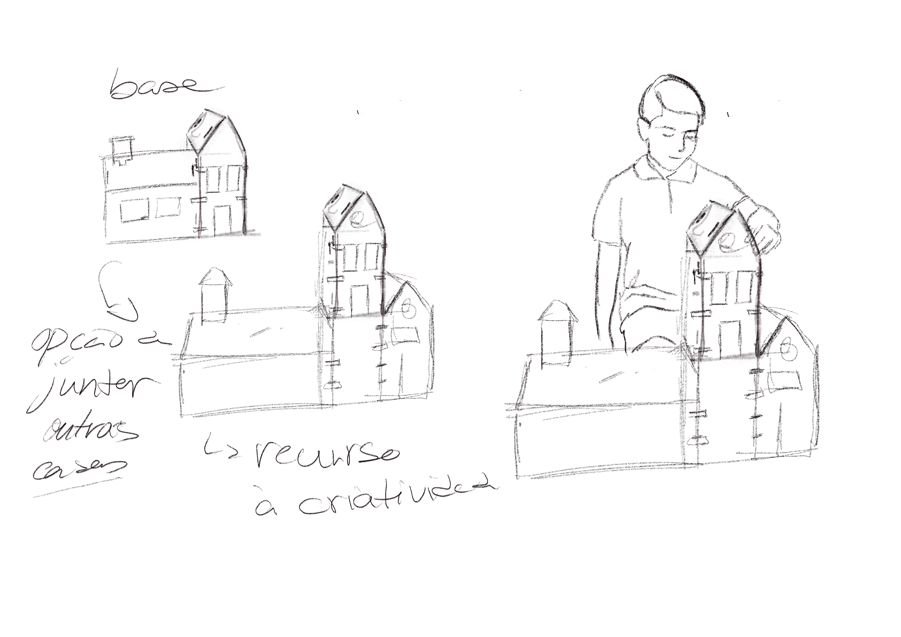

### 7.2. Objetos de referencia

Inventário de precedentes, brinquedos análogos, referências históricas.
Gostei de todas estas referências tanto para a questão mais técnica de encaixes, como é o caso dos Tazoos que serviram como base par pensar nos encaixes, como as casinhas da moranguinho e a referência de uma paragem de autocarro, por ambas serem coisas que ficam na memória e são facilmente relembraveis.
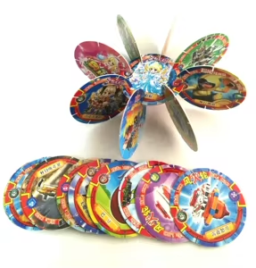
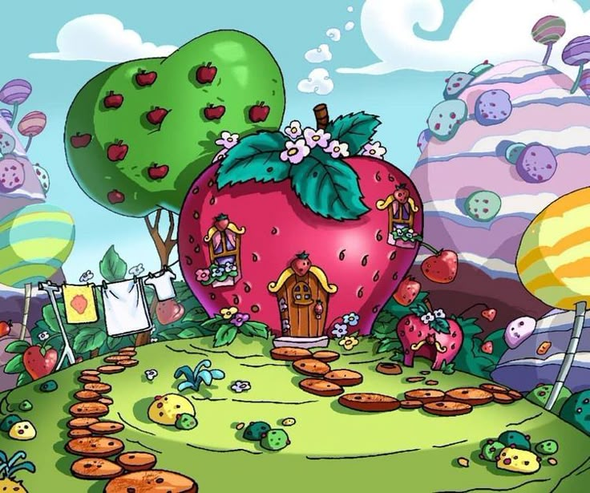
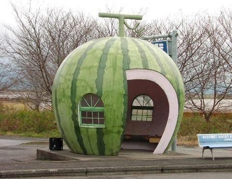
## 9. Outros Elementos

Motivação pós pesquisa para o trabalho.
Vivemos numa época em que a maior parte dos brinquedos são fabricados em plástico, e que por sua vez, mesmo os de maior qualidade acabam por ter um aspecto mais impessoal, e até através da utilização e passagem do tempo adquirirem tons mais amarelados e até mesmo ser notável a degradação desse mesmo material tornando-se peganhento. O plástico por si só também pode ser visto como um símbolo da modernidade, do século XX e aliado às novas tecnologias digitais com os seus ecrãs. Com isto em conta a escolha da madeira surge como uma tentativa de um regresso às origens e às brincadeiras de faz de conta mais antigas, à qualidade dos materiais e duração e longevidade dos mesmos, como os que ainda restam de pais ou irmãos mais velhos comprados nos anos 80 e que perduram até aos nossos dias.

