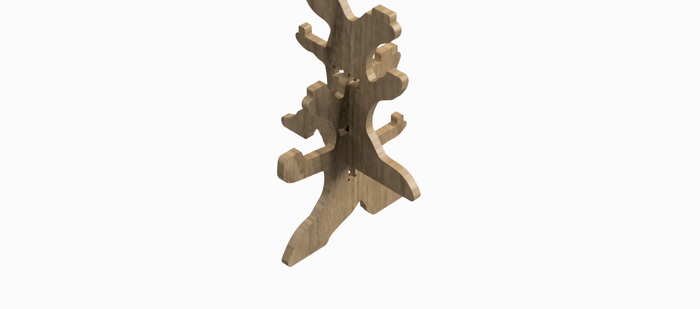

# Crazy Tree

<!--
  HERO: idealmente uma pseudo-sessão fotográfica do produto
  (ver tutorial Pletor.ai nos Recursos da disciplina, em
  /Recursos/AI_exps/). Usa attachments/hero.jpg para o frontmatter.
-->

> **“Constrói um mundo através da imaginação”**

## Conceito

*A Crazy Tree é um brinquedo de cenário de madeira constituído por várias peças (uma árvore montada, 6 peças personagens e 1 escada), tendo como foco principal a peça central construída em formato de árvore. É neste espaço onde a maior parte da sua função, a brincadeira, se desenvolve.*

Esta ideia foi desenvolvida a pensar nas crianças da faixa etária dos 6 aos 10 anos. 
É voltada para esta fase de transição fundamental da infância onde as crianças apreciam melhor jogos e brincadeiras que promovam uma atividade imaginativa complexa.

O principal objetivo deste projeto é promover o desenvolvimento da criatividade, da imaginação e da colaboração de todas as crianças que brinquem com ele. 
Todas as escolhas foram feitas para que se sintam familiarizadas com as suas formas e que encontrem nele um espaço seguro e rico para poderem explorar todas as suas capacidades, construir mundos e realidades partilhadas com outras crianças.

## Enquadramento

A Crazy Tree faz parte da coleção de brinquedos Crazy Town desenvolvida a partir do projeto Nestor.

O universo Crazy Town é composto por vários brinquedos que compõem diferentes cenários lúdicos, entre eles estão casas (Crazy House) e carros (Crazy car). A Crazy Tree por sua vez acrescenta o cenário da Natureza ao escolher redesenhar a árvore como símbolo central.

**(ver [contexto](../../contexto.md)) e à recolha de objetos a redesenhar.

## Tecnologia

O projeto foi desenhado a partir do software de design gráfico Adobe Illustrator, onde foram definidas as principais linhas e medidas iniciais do projeto depois foi traduzido para o software de modelação tridimensional Autodesk Fusion 360, onde passa pelo processo de parametrização e resulta nos ficheiros técnicos necessários para a fabricação que por sua vez é feita através da tecnologia CNC (Controlo Numérico Computorizado) que permite dar, com precisão, corpo às linhas e aos encaixes do desenho paramétrico.

- Desenhos:

- Modelo 3D: https://a360.co/4et3JkV

## Função

A Crazy Tree é um brinquedo de cenário composto por uma árvore montada, 6 peças-personagens e 1 escada. A sua função está centrada na interação das peças-personagens com a árvore que tem vários andares e que lembra bastante uma casa na árvore, esta dinâmica promove a criação de enredos e narrativas como também poder ser utilizada para interpretar várias histórias e contos, ou seja, a brincadeira não tem limites!

A montagem da Crazy Tree é feita através de encaixes simples de pressão que está acessível a qualquer criança da faixa etária indicada.

Segue o link para vizualizar a montagem:
  
Teaser:

O projeto foi desenvolvido em conformidade com os princípios gerais de segurança estabelecidos pela Diretiva 2009/48/CE do Parlamento Europeu e do Concelho de 18/06/2009 relativa à segurança dos brinquedos.

## Apresentação

---

## Processo

O percurso completo de iterações, modelos e pesquisa está em [processo.md](dpiv-galeria-crazytown/produtos/Ítalo/processo.md), organizado do **mais recente** para o **mais antigo**.

[Ver processo completo →](processo.md)
