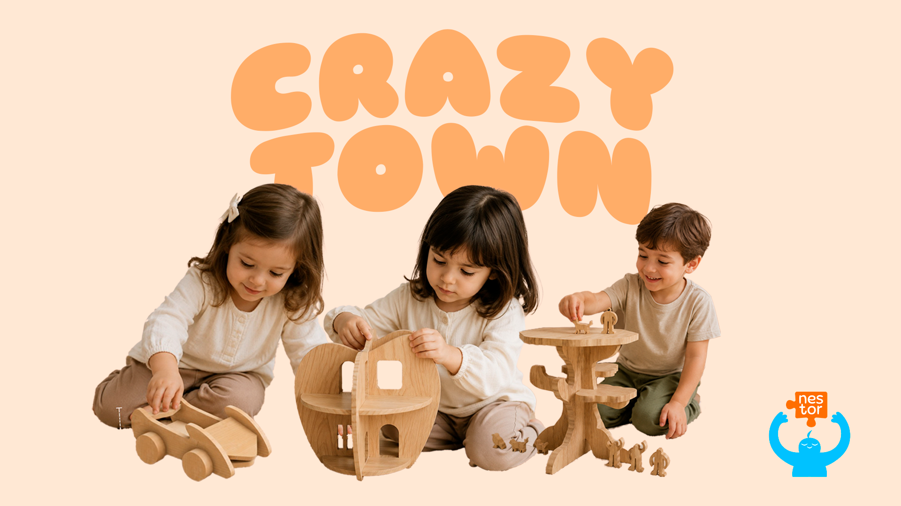

# Crazy Tree

<!--
  HERO: idealmente uma pseudo-sessão fotográfica do produto
  (ver tutorial Pletor.ai nos Recursos da disciplina, em
  /Recursos/AI_exps/). Usa attachments/hero.jpg para o frontmatter.
-->

> **“Constrói um mundo através da imaginação”**

## Conceito

*A Crazy Tree é um brinquedo de cenário de madeira constituído por várias peças (uma árvore montada, 6 peças personagens e 1 escada), tendo como foco principal a peça central construída em formato de árvore. É neste espaço onde a maior parte da sua função, a brincadeira, se desenvolve.*

Esta ideia foi desenvolvida a pensar nas crianças da faixa etária dos 6 aos 10 anos. 
É voltada para esta fase de transição fundamental da infância onde as crianças apreciam melhor jogos e brincadeiras que promovam uma atividade imaginativa complexa.

O principal objetivo deste projeto é promover o desenvolvimento da criatividade, da imaginação e da colaboração de todas as crianças que brinquem com ele. 
Todas as escolhas foram feitas para que se sintam familiarizadas com as suas formas e que encontrem nele um espaço seguro e rico para poderem explorar todas as suas capacidades, construir mundos e realidades partilhadas com outras crianças.

## Enquadramento

A Crazy Tree faz parte da coleção de brinquedos Crazy Town desenvolvida a partir do projeto Nestor.

O universo Crazy Town é composto por vários brinquedos que compõem diferentes cenários lúdicos, entre eles estão casas (Crazy House) e carros (Crazy car). A Crazy Tree por sua vez acrescenta o cenário da Natureza ao escolher redesenhar a árvore como símbolo central.

**(ver [contexto](../../contexto.md)) e à recolha de objetos a redesenhar.

## Tecnologia

Materiais (espécie de madeira), processos de fabrico (CNC, laser, impressão 3D), software paramétrico, ficheiros técnicos.

-Briquedo feito com madeira de pinho para ser cortado em CNC.

- Modelo 3D: https://a360.co/4et3JkV
- Ficheiros: `attachments/`

## Função

Como se brinca, idade-alvo, montagem, conformidade com a Diretiva 2009/48/CE.

## Apresentação

Imagens-chave que sintetizam o produto final.

---

## Processo

O percurso completo de iterações, modelos e pesquisa está em [processo.md](dpiv-galeria-crazytown/produtos/Ítalo/processo.md), organizado do **mais recente** para o **mais antigo**.

[Ver processo completo →](processo.md)
