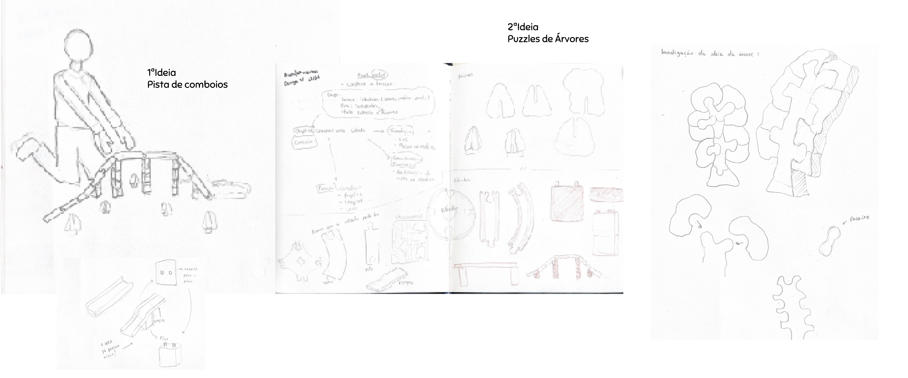
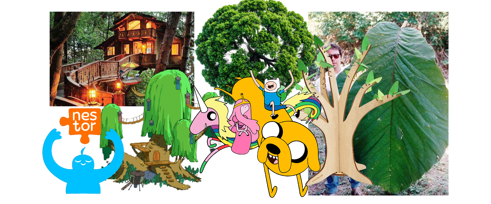
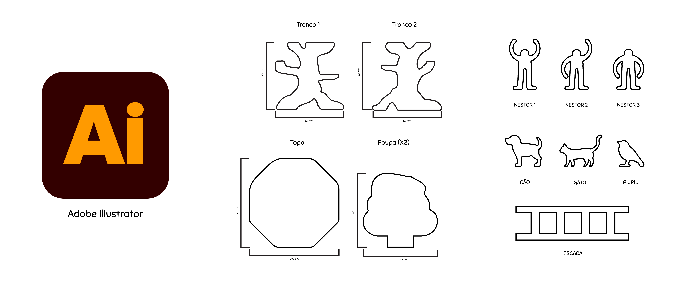

# Processo

> Organizado do **mais recente** para o **mais antigo**.

## Esboços

## Moodboard Individual

## Desenhos digitais (esboços e finais)

## Modelos 3D

Embed do Fusion (visualização do modelo paramétrico).

- Modelo 3D: https://a360.co/4et3JkV

